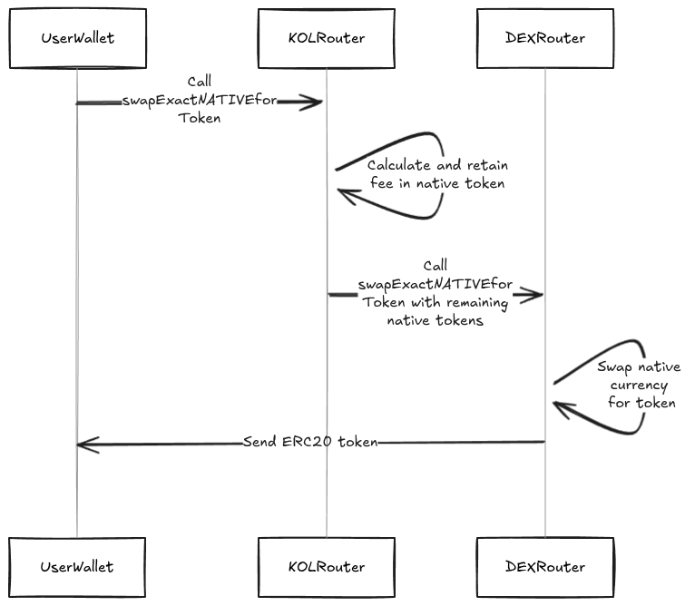
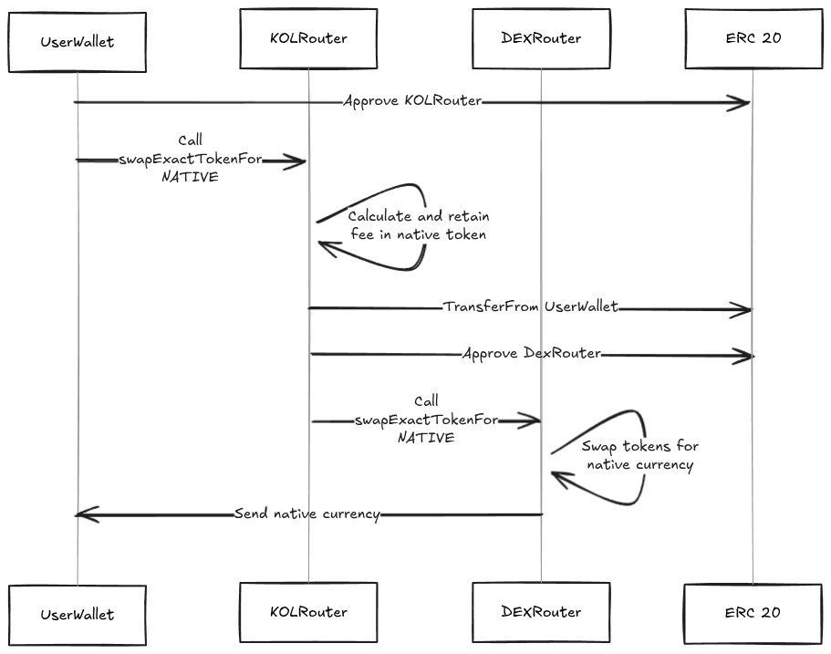
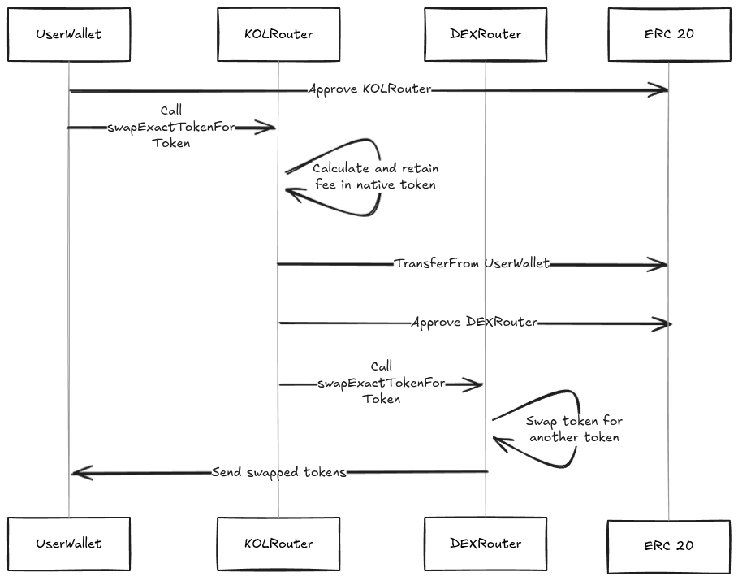
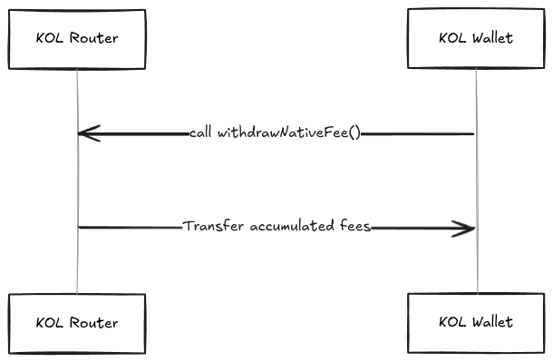

# KOLSwapRouter System

## 1. Introduction

The **KOLSwapRouter** system enables Key Opinion Leaders (KOLs) to promote and monetize token transactions through dedicated smart contract routers. These routers are designed to be integrated into **Sherry's mini-apps**, which render interactive swap interfaces directly within social media platforms such as Discord, YouTube, and X (formerly Twitter). KOLs earn a configurable fee in the native token of the network (e.g., AVAX) from each user-initiated swap routed to supported DEX protocols like ArenaSwap, TraderJoe, and Pangolin.

## 2. System Architecture

### Overview Diagram

```
                          +--------------------------------+
                          |       KOLSwapRouterBase        |
                          |  (Common router functionality) |
                          +---------------+----------------+
                                          |
                                          | extends
                                          |
          +-------------------------------+-------------------------------+
          |                               |                               |
          v                               v                               v
+---------------------------+ +----------------------------+ +----------------------------+
|    KOLRouterArenaSwap       | |    KOLRouterTraderJoe      | |    KOLRouterPangolin       |
|(ArenaSwap-specific methods) | |(TraderJoe-specific methods)| |(Pangolin-specific methods) |
+---------------------------+ +----------------------------+ +----------------------------+
          ^                               ^                               ^
          |                               |                               |
          | creates                       | creates                       | creates
          |                               |                               |
+---------------------------+ +---------------------------+ +---------------------------+
|    KOLFactoryArenaSwap      | |    KOLFactoryTraderJoe    | |    KOLFactoryPangolin     |
+---------------+-----------+ +---------------+-----------+ +---------------+-----------+
                |                             |                             |
                | extends                     | extends                     | extends
                |                             |                             |
                v                             v                             v
          +-------------------------------------------------------------------+
          |                         KOLFactoryBase                            |
          |               (Common factory functionality)                      |
          +-------------------------------------------------------------------+
```

### Key Layers

- **Router Base**: Common router logic including fee processing, withdrawals, access control.
- **Protocol Routers**: Protocol-specific integrations with ArenaSwap, TraderJoe, Pangolin.
- **Factory Base**: Common factory logic to deploy and manage routers.
- **Protocol Factories**: Create routers for individual KOLs for each protocol.

## 3. Workflow

1. A KOL registers through a protocol-specific factory.
2. The factory deploys a dedicated router contract for that KOL.
3. The KOL sets their custom fee (in BPS).
4. Users interact with the KOL router to perform swaps:

   - The router takes a fee in the native token.
   - The remaining amount is routed via the target DEX.

5. The KOL can withdraw accumulated native fees at any time.

## 4. Swap Flow Description

This section describes the detailed flow of each supported swap operation initiated by a user through a KOLRouter.

> Note: The function names shown here are representative. Actual function names may vary slightly depending on the protocol integration, but the available swap types remain consistent across all supported protocols.

### Involved Parties

- **User Wallet**: The wallet initiating the swap.
- **KOL Router Contract**: The proxy handling the swap on behalf of the user.
- **DEX Router Contract**: The official router from the respective protocol (e.g., ArenaSwap, LBRouter).
- **KOL Wallet**: The recipient of the swap fee in native token.

### 4.1 swapExactNATIVEForToken



1. The **user wallet** sends native tokens (e.g., AVAX) and calls `swapExactNATIVEForToken` on the **KOLRouter**.
2. The **KOLRouter**:

   - Calculates the fee (based on BPS configuration).
   - Retains the fee in the contract.
   - Forwards the remaining native token amount to the **DEX Router**.

3. The **DEX Router** swaps the received AVAX for the desired ERC20 token and sends it to the **user wallet**.

### 4.2 swapExactTokenForNATIVE



1. The **user wallet** approves the **KOLRouter** to spend ERC20 tokens, then calls `swapExactTokenForNATIVE`.
2. The **KOLRouter**:

   - Calculates and retains the fee in native token.
   - Transfers the ERC20 tokens from the **user wallet**.
   - Approves the **DEX Router** to spend tokens and forwards them.

3. The **DEX Router** swaps tokens for native currency and sends it to the **user wallet**.

### 4.3 swapExactTokenForToken



1. The **user wallet** approves the **KOLRouter** to spend ERC20 tokens, then calls `swapExactTokenForToken`.
2. The **KOLRouter**:

   - Calculates and retains the fee in native token.
   - Transfers the ERC20 tokens from the **user wallet**.
   - Approves and forwards tokens to the **DEX Router**.

3. The **DEX Router** swaps the input token for another token and sends it to the **user wallet**.

### 4.4 withdrawNativeFee Flow

This optional flow can be initiated by the KOL at any time to retrieve their accumulated fees.



1. The **KOL Wallet** calls `withdrawNativeFee()` on the **KOLRouter**.
2. The **KOLRouter** transfers the collected native token fees to the **KOL Wallet**.

## 5. Security Considerations

- **Access Control**: `Ownable` and `onlyFactoryAdmin` patterns restrict sensitive operations.
- **Reentrancy Protection**: All routers use `ReentrancyGuard` to prevent recursive attacks.
- **Minimal Handling**: The router does not perform swap logic; it delegates to DEX router contracts.
- **Event Logging**: All key actions emit events (`SwapExecuted`, `FeeCollected`).

## 6. Extensibility

Adding new protocols involves:

1. Creating a new `KOLRouterX` contract inheriting `KOLSwapRouterBase`
2. Implementing swap calls using the respective DEX SDK/API
3. Creating a `KOLFactoryX` contract inheriting `KOLFactoryBase`

This modular architecture allows safe, incremental expansion while maintaining auditability.

## 7. Supported DEX Protocols

- ArenaSwap V1
- TraderJoe V1, V2
- Pangolin V2

## 8. Technical References

For detailed function signatures, inheritance structure, and technical specifications, refer to the following contract documentation:

 - [❱ interfaces](contracts/kol-router/interfaces/README.md)
   - [IArenaRouter01](contracts/kol-router/interfaces/IArenaRouter01.sol/interface.IArenaRouter01.md)
   - [IKOLFactory](contracts/kol-router/interfaces/IKOLFactory.sol/interface.IKOLFactory.md)
   - [ILBRouter](contracts/kol-router/interfaces/ILBRouter.sol/interface.ILBRouter.md)
   - [IPangolinRouter](contracts/kol-router/interfaces/IPangolinRouter.sol/interface.IPangolinRouter.md)
   - [IUniversalRouter](contracts/kol-router/interfaces/IUniversalRouter.sol/interface.IUniversalRouter.md)
 - [KOLFactoryArenaSwap](contracts/kol-router/KOLFactoryArenaSwap.sol/contract.KOLFactoryArenaSwap.md)
 - [KOLFactoryBase](contracts/kol-router/KOLFactoryBase.sol/abstract.KOLFactoryBase.md)
 - [KOLFactoryPangolin](contracts/kol-router/KOLFactoryPangolin.sol/contract.KOLFactoryPangolin.md)
 - [KOLFactoryTraderJoe](contracts/kol-router/KOLFactoryTraderJoe.sol/contract.KOLFactoryTraderJoe.md)
 - [KOLRouterArenaSwap](contracts/kol-router/KOLRouterArenaSwap.sol/contract.KOLRouterArenaSwap.md)
 - [KOLRouterPangolinV2](contracts/kol-router/KOLRouterPangolinV2.sol/contract.KOLRouterPangolinV2.md)
 - [KOLRouterTraderJoe](contracts/kol-router/KOLRouterTraderJoe.sol/contract.KOLRouterTraderJoe.md)
 - [KOLSwapRouterBase](contracts/kol-router/KOLSwapRouterBase.sol/abstract.KOLSwapRouterBase.md)
